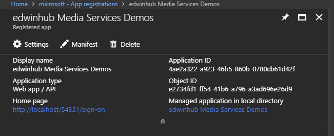
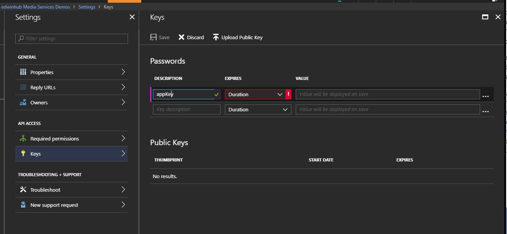
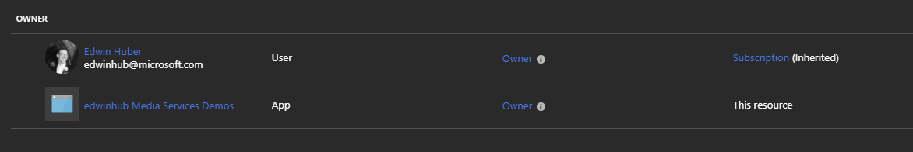
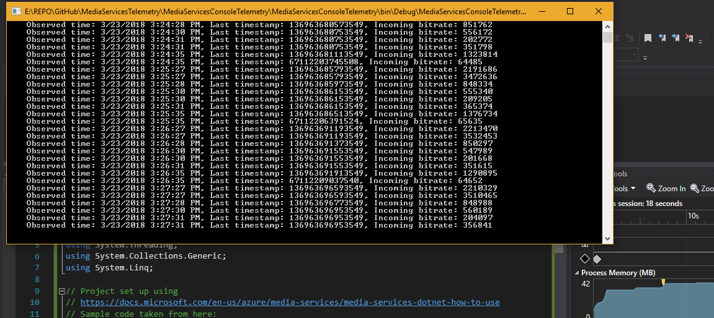
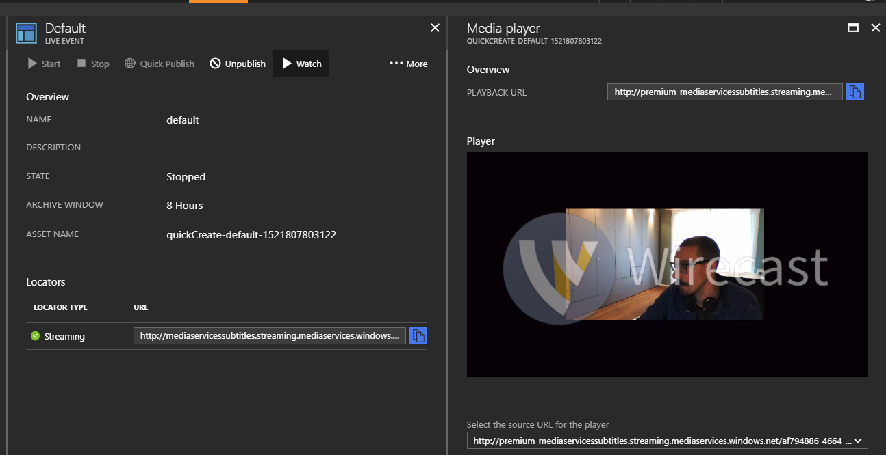
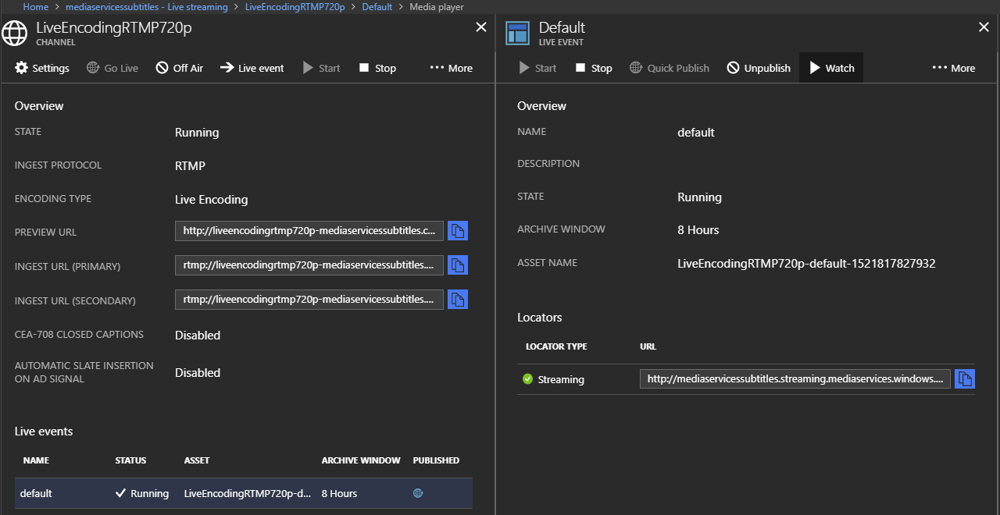
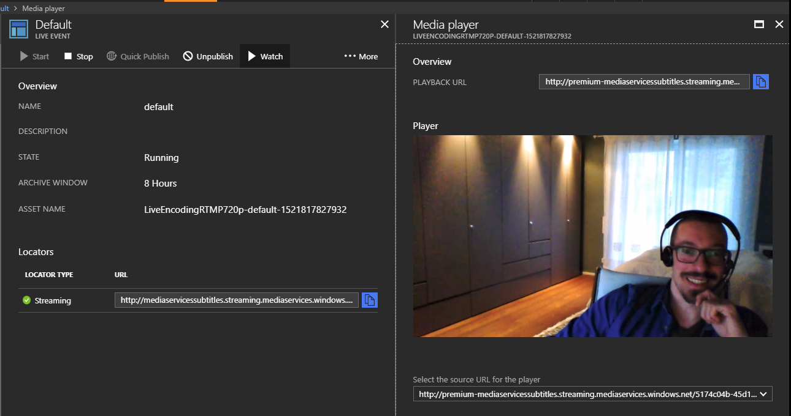
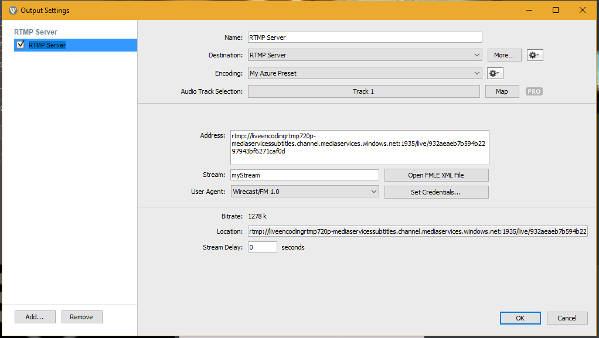
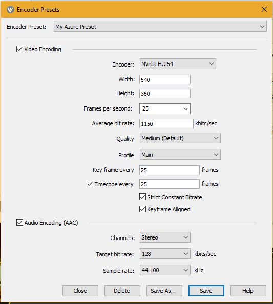
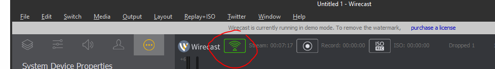

# MediaServicesTelemetryConsole

First make sure that  you have a functioning streaming or live endpoint in Azure Media Services.

Then create an application service principal that our telemetry application will use to log into AMS.

You can use this information:

https://docs.microsoft.com/en-us/azure/media-services/media-services-use-aad-auth-to-access-ams-api

In my case I registered "edwinhub Media Services Demos" by going to the app registrations blade  under the Active Directory Pane for my org & subscription.

At this point, I made a not of the application name "edwinhub Media Services Demos" and the App Id.

Then clicked on settings to create a new app key:

Which gave me my key to put in the app.config.

I was then able to add this account (service principal) to Azure Media Services under "Access Control"

And apply the  appropriate settings in the .Net project's app.config

Once you have added the app service to the Access Control (IAM)… you might find that you still see 401 Unauthorized.
It can sometimes take a little while for the changes to replicate across all the systems involved.

When you run the project, it will allow you to configure the endpoints for which you collect the telementry, and then you can see it come up in the console:

In my topology, I had both :

a **Passthrough** Live Streaming endpoint:

an endpoint using **Live Encoding** :

To get this setup, you can use the  following article as a rough guide:

https://azure.microsoft.com/en-us/blog/azure-media-services-rtmp-support-and-live-encoders/

The version of Wirecast has changed since then, and the following might be useful...

For my test, I did not have very much bandwidth to spare... so my settings were tuned down low:

and the button to broadcast the stream:

If you don't want to use a web cam, you can just broadcast an MP4 that you have lying around.
